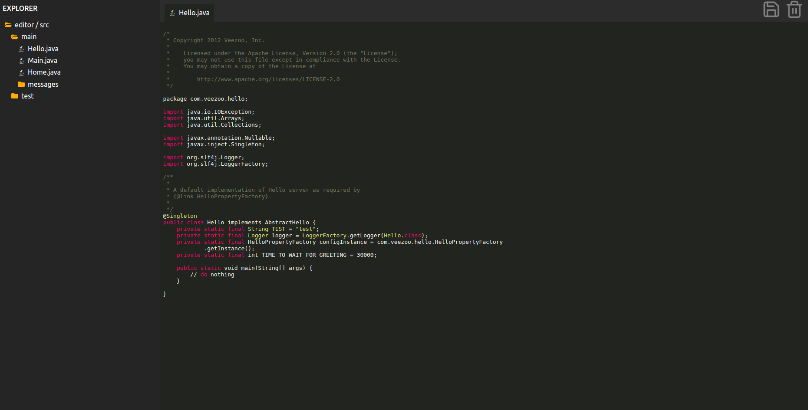

# online-code-editor
Online Code Editor built with React, Parcel, React-icons &amp; Highlight.js

## Testing it

### Install the dependencies

At the project root execute `npm install`

### Execute Application

Execute `npm start` and head over to http://localhost:1234

### Execute unit tests

`npm test`
